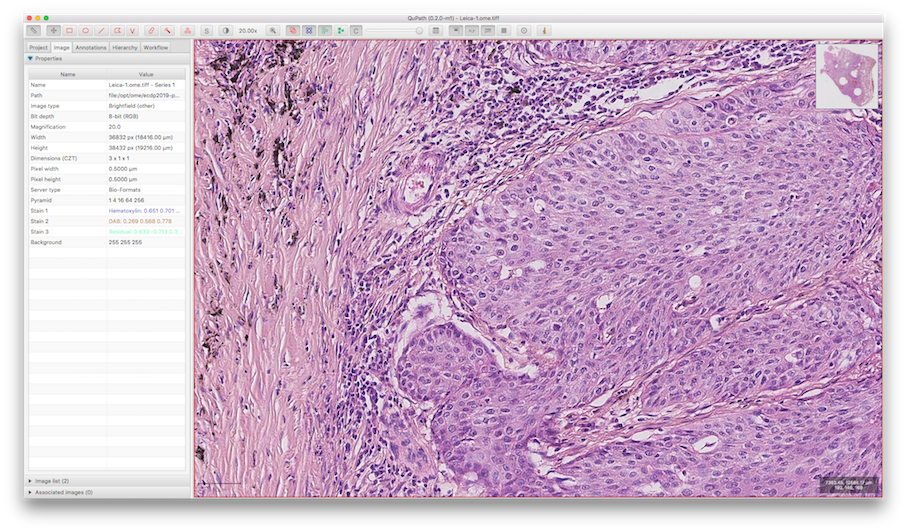

# Bringing Open Data to Whole Slide Imaging

This repository contains the supporting material for the technical paper on
the pyramidal OME-TIFF format and the BIo-Formats implementation submitted for
the 15th European Congress on Digital Pathology (ECDP).

## Specification

[OME-TIFF](https://docs.openmicroscopy.org/latest/ome-model/ome-tiff/) is an
open file format allowing to store multidimensional images combining the
OME imaging metadata model and the 
[TIFF](https://www.adobe.io/open/standards/TIFF.html) specification.

In February 2019, the OME-TIFF specification was updated to add backwards
compatible support for multi-resolution images like Whole Slide Images. The
[sub-resolutions](https://docs.openmicroscopy.org/latest/ome-model/ome-tiff/data.html#sub-resolutions)
section of the OME-TIFF specification describes how downsampled images or
sub-resolutions must be stored using the
[SubIFDs](https://www.awaresystems.be/imaging/tiff/tifftags/subifds.html)
extension tag of the [TIFF](https://www.adobe.io/open/standards/TIFF.html)
specification.

Public examples of WSI images with various modalities (brightfield,
fluorescence, Z-stack, multichannel) are publicly available as
[OME-TIFF samples](https://docs.openmicroscopy.org/latest/ome-model/ome-tiff/data.html#sub-resolutions).

## Generation

The [Bio-Formats](https://www.openmicroscopy.org/bio-formats/) library supports
the reading of over 150 proprietary file formats (PFFs) including multiple 
Whole Slide Imaging (WSI) formats. In addition, it acts as the reference Java
implementation for reading and writing OME-TIFF files.

[Bio-Formats 6.0.0](https://www.openmicroscopy.org/2019/02/18/bio-formats-6-0-0.html)
introduces support for the updated OME-TIFF specification with
sub-resolutions.
[Binaries](https://downloads.openmicroscopy.org/bio-formats/6.0.0/),
[API documentation](https://downloads.openmicroscopy.org/bio-formats/6.0.0/api/)
and [technical documentation](https://docs.openmicroscopy.org/bio-formats/6.0.0/)
of this release are all publicly and freely available.

The Bio-Formats `bfconvert` command line utility was used to convert
WSI PFFs into open OME-TIFF with different compressions, tile sizes. When
no pyramidal levels are present in the original image, this command allows
to specify a number of sub-resolutions to be generated with a given
downsampling factory.

To test the generation of multi-resolution OME-TIFF files, we used a set of
[original WSI PFFs](converter/sample_sources.txt) covering various modalities
(brightfield, fluorescence, multi-channel, multi-Z, floating point). The
[generate-samples.sh](generate-samples.sh) script contains the conversion
parameters used for generating the derived OME-TIFF files.

It is possible to reproduce this conversion using the [Docker](converter/Dockerfile) image included in this code:

        $ docker build -t converter converter
        $ docker run --rm -it -v $(pwd)/data:/out converter

This will generate OME-TIFF files under the [data](data) folder.
Alternatively, you can directly download the
[official OME-TIFF samples](ometiff_list.txt):

        $ wget -i ometiff_list.txt -P data/
## Validation

The OME-TIFF datasets generated in the previous section have been validated
using two open-source application using Bio-Formats for reading WSI:

- [QuPath](https://qupath.github.io) a software platform for whole slide image analysis
- [OMERO](https://www.openmicroscopy.org/omero) a data management platform

A [milestone release of QuPath 0.2.0](https://github.com/qupath/qupath/releases/tag/v0.2.0-m1)
has been released including support for OME-TIFF pyramids. After downloading
and extracting the application, images can be imported using `File > Open`.

A full [OMERO](https://www.openmicroscopy.org/omero) application using OMERO 5.4.10, Bio-Formats 6.0.0 and OMERO.iviewer can be deployed via
[Docker compose](https://docs.docker.com/compose/). All the images under
the [data](data) folder will be auto-imported at startup time:

    $ docker-compose build
    $ docker-compose up -d

After deployment, you can log in to http://localhost:4080/webclient using the
`root` user with the password `omero`.

